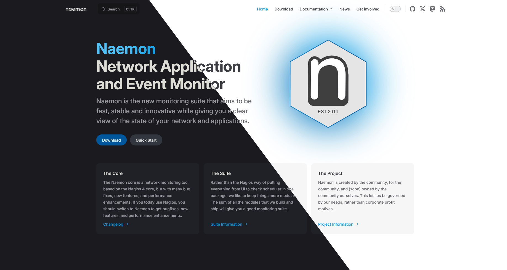

# Naemon Documentation

This repository contains the documentation and website of the Naemon project.



## Contributing

This site is built with [VitePress](https://vitepress.dev/). The site content is written in Markdown located in the `src` folder. For simple edits, you can directly edit the file on GitHub and generate a Pull Request.

## Run development server

Please see the documentation of how to setup a local copy of the Naemon website.

[Run Naemon Website Locally](./documentation/developer/website.md)

### In a nutshell

```sh
git clone https://github.com/naemon/naemon.github.io.git
cd naemon.github.io/

npm install
npm run docs:dev
```

### Using Docker

In case you do not want to install Nodejs to your system, you can also use Docker

First build the Docker image which will contain N Nodejs - thats all this documentation has no dependencies

```sh
docker build . -t naemon/docs
```

or simply run:

```sh
make docker-build
```

Now run the Docker container and navigate to `http://127.0.0.1:5173` in your browser.
The container watches for file changes and will automatically regenerate the website if needed.

```sh
docker run \
  --rm -it \
  -p 5173:5173 \
  --name=naemon-docs \
  -v $PWD:/opt/node_app/app \
  -v /opt/node_app/node_modules/ \
  -v /opt/node_app/app/.vitepress/cache \
  -v /opt/node_app/app/.vitepress/dist \
  -v $PWD/package.json:/opt/node_app/package.json \
  naemon/docs:latest
```

or simply run:

```sh
make docker-server
```

