
See Also: <a href="configcgi.html">CGI Configuration File Options</a>,
          <a href="cgiauth.html">Authentication And Authorization In The CGIs</a>,
          <a href="cgiincludes.html">CGI Footers and Headers</a>,
          <a href="cgisecurity.html">CGI Security</a>

### Introduction

The various CGIs distributed with Naemon are described here, along with the
authorization requirements for accessing and using each CGI. By default the
CGIs require that you have authenticated to the web server and are authorized
to view any information you are requesting. More information on configuring
authorization can be found <a href="cgiauth.html">here</a>.

### Standard Pages

* <a href="#status_cgi">Status CGI</a>
* <a href="#statusmap_cgi">Status map CGI</a>
* <a href="#tac_cgi">Tactical overview CGI</a>
* <a href="#outages_cgi">Network outages CGI</a>
* <a href="#config_cgi">Configuration CGI</a>
* <a href="#cmd_cgi">Command CGI</a>
* <a href="#extinfo_cgi">Extended information CGI</a>
* <a href="#showlog_cgi">Event log CGI</a>
* <a href="#history_cgi">Alert history CGI</a>
* <a href="#notifications_cgi">Notifications CGI</a>
* <a href="#trends_cgi">Trends CGI</a>
* <a href="#avail_cgi">Availability reporting CGI</a>
* <a href="#summary_cgi">Alert summary CGI</a>

#### Status CGI

<table border="0" class="screenshot_thumbnails">
<tr>
<td align="left">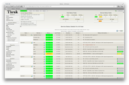</td>
<td align="left">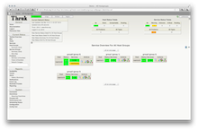</td>
<td align="left">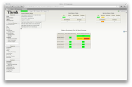</td>
<td align="left">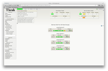</td>
</tr>
</table>

<table border="0">
<tr>
<td>Url:</td>
<td><b>status.cgi</b></td>
</tr>
</table>

<table border="0" width="100%">
<tr>
<td align="left" valign="top" width="50%">

<b>Description:</b>
This is the most important CGI included with Naemon. It allows you to view the current status
of all hosts and services that are being monitored. The status CGI can produce two main types
of output - a status overview of all host groups (or a particular host group) and a detailed
view of all services (or those associated with a particular host).

<b>Authorization Requirements:</b>
<ul>
<li>If you are <a href="configcgi.html#authorized_for_all_hosts"><i>authorized for all hosts</i></a> you can view all hosts <b>and</b> all services.</li>
<li>If you are <a href="configcgi.html#authorized_for_all_services"><i>authorized for all services</i></a> you can view all services.</li>
<li>If you are an <i>authenticated contact</i> you can view all hosts and services for which you are a contact.</li>
</ul>
</td>
</tr>
</table>

#### Status Map CGI

<table border="0" class="screenshot_thumbnails">
<tr>
<td align="left">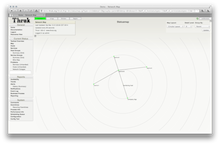</td>
</tr>
</table>

<table border="0">
<tr>
<td>Url:</td>
<td><b>statusmap.cgi</b></td>
</tr>
</table>

<table border="0" width="100%">
<tr>
<td align="left" valign="top" width="50%">

<b>Description:</b>
This CGI creates a map of all hosts that you have defined on your network.
The CGI uses Thomas Boutell's <a href="http://www.boutell.com/gd/">gd</a> library
(version 1.6.3 or higher) to create a PNG image of your network layout.
The coordinates used when drawing each host (along with the optional pretty icons)
are taken from <a href="objectdefinitions.html#host">host</a> definitions.
If you'd prefer to let the CGI automatically generate drawing coordinates for
you, use the default_statusmap_layout
directive to specify a layout algorithm that should be used.

<b>Authorization Requirements:</b>
<ul>
<li>If you are <a href="configcgi.html#authorized_for_all_hosts"><i>authorized for all hosts</i></a> you can view all hosts.</li>
<li>If you are an <i>authenticated contact</i> you can view hosts for which you are a contact.</li>
</ul>
</td>
</tr>
</table>

#### Tactical Overview CGI

<table border="0" class="screenshot_thumbnails">
<tr>
<td align="left">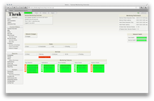</td>
</tr>
</table>

<table border="0">
<tr>
<td>Url:</td>
<td><b>tac.cgi</b></td>
</tr>
</table>

<table border="0" width="100%">
<tr>
<td align="left" valign="top" width="50%">

<b>Description:</b>
This CGI is designed to server as a "birds-eye view" of all network monitoring activity.
It allows you to quickly see network outages, host status, and service status.
It distinguishes between problems that have been "handled" in some way (i.e. been
acknowledged, had notifications disabled, etc.) and those which have not been
handled, and thus need attention. Very useful if you've got a lot of hosts/services
you're monitoring and you need to keep a single screen up to alert you of problems.

<b>Authorization Requirements:</b>
<ul>
<li>If you are <a href="configcgi.html#authorized_for_all_hosts"><i>authorized for all hosts</i></a> you can view all hosts <b>and</b> all services.</li>
<li>If you are <a href="configcgi.html#authorized_for_all_services"><i>authorized for all services</i></a> you can view all services.</li>
<li>If you are an <i>authenticated contact</i> you can view all hosts and services for which you are a contact.</li>
</ul>
</td>
</tr>
</table>

#### Network Outages CGI

<table border="0" class="screenshot_thumbnails">
<tr>
<td align="left">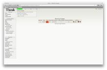</td>
</tr>
</table>

<table border="0">
<tr>
<td>Url:</td>
<td><b>outages.cgi</b></td>
</tr>
</table>

<table border="0" width="100%">
<tr>
<td align="left" valign="top" width="50%">

<b>Description:</b>
This CGI will produce a listing of "problem" hosts on your network that are causing network
outages. This can be particularly useful if you have a large network and want to
quickly identify the source of the problem. Hosts are sorted based on the severity
of the outage they are causing.

<b>Authorization Requirements:</b>
<ul>
<li>If you are <a href="configcgi.html#authorized_for_all_hosts"><i>authorized for all hosts</i></a> you can view all hosts.</li>
<li>If you are an <i>authenticated contact</i> you can view hosts for which you are a contact.</li>
</ul>
</td>
</tr>
</table>

#### Configuration CGI

<table border="0" class="screenshot_thumbnails">
<tr>
<td align="left">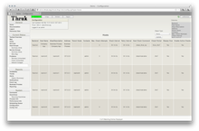</td>
</tr>
</table>

<table border="0">
<tr>
<td>Url:</td>
<td><b>config.cgi</b></td>
</tr>
</table>

<table border="0" width="100%">
<tr>
<td align="left" valign="top" width="50%">

<b>Description:</b>
This CGI allows you to view objects (i.e. hosts, host groups, contacts, contact groups,
time periods, services, etc.) that you have defined in your <a href="configobject.html">object configuration file(s)</a>.

<b>Authorization Requirements:</b>
<ul>
<li>You must be <a href="configcgi.html#authorized_for_configuration_information"><i>authorized for configuration information</i></a> in order to any kind of configuration information.</li>
</ul>
</td>
</tr>
</table>

#### Command CGI

<table border="0" class="screenshot_thumbnails">
<tr>
<td align="left">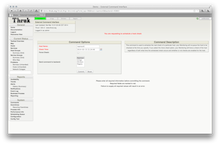</td>
</tr>
</table>

<table border="0">
<tr>
<td>Url:</td>
<td><b>cmd.cgi</b></td>
</tr>
</table>

<table border="0" width="100%">
<tr>
<td align="left" valign="top" width="50%">

<b>Description:</b>
This CGI allows you to send commands to the Naemon process. Although this CGI
has several arguments, you would be better to leave them alone. Most will change
between different revisions of Naemon. Use the <a href="#extinfo_cgi">extended information CGI</a> as
a starting point for issuing commands.

<b>Authorization Requirements:</b>
<ul>
<li>You must be <a href="configcgi.html#authorized_for_system_commands"><i>authorized for system commands</i></a> in order to issue  commands that affect the Naemon process (restarts, shutdowns, mode changes, etc.).</li>
<li>If you are <a href="configcgi.html#authorized_for_all_host_commands"><i>authorized for all host commands</i></a> you can issue commands for all hosts <b>and</b> services.</li>
<li>If you are <a href="configcgi.html#authorized_for_all_service_commands"><i>authorized for all service commands</i></a> you can issue commands for all services.</li>
<li>If you are an <i>authenticated contact</i> you can issue commands for all hosts and services for which you are a contact.</li>
</ul>
<b>Notes:</b>
<ul>
<li>If you have chosen not to <a href="configcgi.html#use_authentication">use authentication</a> with the CGIs, this CGI will <i>not</i> allow anyone to issue commands to Naemon.  This is done for your own protection.  I would suggest removing this CGI altogether if you decide not to use authentication with the CGIs.</li>
</ul>
</td>
</tr>
</table>

#### Extended Information CGI

<table border="0" class="screenshot_thumbnails">
<tr>
<td align="left">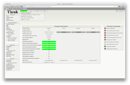</td>
<td align="left">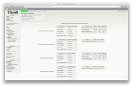</td>
<td align="left">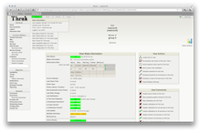</td>
<td align="left">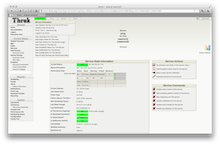</td>
</tr>
</table>

<table border="0">
<tr>
<td>Url:</td>
<td><b>extinfo.cgi</b></td>
</tr>
</table>

<table border="0" width="100%">
<tr>
<td align="left" valign="top" width="50%">

<b>Description:</b>
This CGI allows you to view Naemon process information, host and service state statistics, host and service comments, and more.
It also serves as a launching point for sending commands to Naemon via the <a href="#cmd_cgi">command CGI</a>.
Although this CGI has several arguments, you would be better to leave them alone - they are likely to change between different
releases of Naemon.  You can access this CGI by clicking on the 'Network Health' and 'Process Information' links on the side
navigation bar, or by clicking on a host or service link in the output of the <a href="#status_cgi">status CGI</a>.

<b>Authorization Requirements:</b>
<ul>
<li>You must be <a href="configcgi.html#authorized_for_system_information"><i>authorized for system information</i></a> in order to view Naemon process information.</li>
<li>If you are <a href="configcgi.html#authorized_for_all_hosts"><i>authorized for all hosts</i></a> you can view extended information for all hosts <b>and</b> services.</li>
<li>If you are <a href="configcgi.html#authorized_for_all_services"><i>authorized for all services</i></a> you can view extended information for all services.</li>
<li>If you are an <i>authenticated contact</i> you can view extended information for all hosts and services for which you are a contact.</li>
</ul>
</td>
</tr>
</table>

#### Event Log CGI

<table border="0" class="screenshot_thumbnails">
<tr>
<td align="left">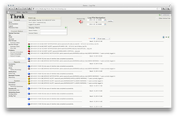</td>
</tr>
</table>

<table border="0">
<tr>
<td>Url:</td>
<td><b>showlog.cgi</b></td>
</tr>
</table>

<table border="0" width="100%">
<tr>
<td align="left" valign="top" width="50%">

<b>Description:</b>
This CGI will display the <a href="configmain.html#log_file">log file</a>.
If you have log rotation enabled, you can browse
notifications present in archived log files by using the navigational links near the top of the page.

<b>Authorization Requirements:</b>
<ul>
<li>You must be <a href="configcgi.html#authorized_for_system_information"><i>authorized for system information</i></a> in order to view the log file.</li>
</ul>
</td>
</tr>
</table>

#### Alert History CGI

<table border="0" class="screenshot_thumbnails">
<tr>
<td align="left">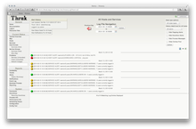</td>
</tr>
</table>

<table border="0">
<tr>
<td>Url:</td>
<td><b>history.cgi</b></td>
</tr>
</table>

<table border="0" width="100%">
<tr>
<td align="left" valign="top" width="50%">

<b>Description:</b>
This CGI is used to display the history of problems with either a particular host or all hosts.
The output is basically a subset of the information that is displayed by the <a href="#showlog_cgi">log file CGI</a>.
You have the ability to filter the output to display only the specific types of problems you wish to
see (i.e. hard and/or soft alerts, various types of service and host alerts, all types of alerts, etc.).
If you have log rotation enabled, you can browse history information present in archived log
files by using the navigational links near the top of the page.

<b>Authorization Requirements:</b>
<ul>
<li>If you are <a href="configcgi.html#authorized_for_all_hosts"><i>authorized for all hosts</i></a> you can view history information for all hosts <b>and</b> all services.</li>
<li>If you are <a href="configcgi.html#authorized_for_all_services"><i>authorized for all services</i></a> you can view history information for all services.</li>
<li>If you are an <i>authenticated contact</i> you can view history information for all services and hosts for which you are a contact.</li>
</ul>
</td>
</tr>
</table>

#### Notifications CGI

<table border="0" class="screenshot_thumbnails">
<tr>
<td align="left">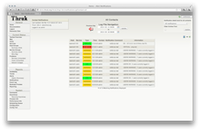</td>
</tr>
</table>

<table border="0">
<tr>
<td>Url:</td>
<td><b>notifications.cgi</b></td>
</tr>
</table>

<table border="0" width="100%">
<tr>
<td align="left" valign="top" width="50%">

<b>Description:</b>
This CGI is used to display host and service notifications that have been sent to various contacts.
The output is basically a subset of the information that is displayed by the <a href="#showlog_cgi">log file CGI</a>.
You have the ability to filter the output to display only the specific types of notifications you wish to
see (i.e. service notifications, host notifications, notifications sent to specific contacts, etc).
If you have log rotation enabled, you can browse notifications present in archived log files by using
the navigational links near the top of the page.

<b>Authorization Requirements:</b>
<ul>
<li>If you are <a href="configcgi.html#authorized_for_all_hosts"><i>authorized for all hosts</i></a> you can view notifications for all hosts <b>and</b> all services.</li>
<li>If you are <a href="configcgi.html#authorized_for_all_services"><i>authorized for all services</i></a> you can view notifications for all services.</li>
<li>If you are an <i>authenticated contact</i> you can view notifications for all services and hosts for which you are a contact.</li>
</ul>
</td>
</tr>
</table>

#### Trends CGI

<table border="0" class="screenshot_thumbnails">
<tr>
<td align="left">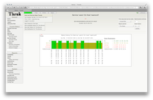</td>
</tr>
</table>

<table border="0">
<tr>
<td>Url:</td>
<td><b>trends.cgi</b></td>
</tr>
</table>

<table border="0" width="100%">
<tr>
<td align="left" valign="top" width="50%">

<b>Description:</b>
This CGI is used to create a graph of host or service states over an arbitrary period of time.
In order for this CGI to be of much use, you should enable log rotation and
keep archived logs in the path specified by the log_archive_path directive.

The CGI uses Thomas Boutell's <a href="http://www.boutell.com/gd/">gd</a> library (version 1.6.3 or higher) to create the trends image.

<b>Authorization Requirements:</b>
<ul>
<li>If you are <a href="configcgi.html#authorized_for_all_hosts"><i>authorized for all hosts</i></a> you can view trends for all hosts <b>and</b> all services.</li>
<li>If you are <a href="configcgi.html#authorized_for_all_services"><i>authorized for all services</i></a> you can view trends for all services.</li>
<li>If you are an <i>authenticated contact</i> you can view trends for all services and hosts for which you are a contact.</li>
</ul>
</td>
</tr>
</table>

#### Availability Reporting CGI

<table border="0" class="screenshot_thumbnails">
<tr>
<td align="left">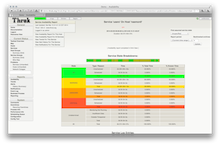</td>
<td align="left">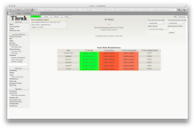</td>
</tr>
</table>

<table border="0">
<tr>
<td>Url:</td>
<td><b>avail.cgi</b></td>
</tr>
</table>

<table border="0" width="100%">
<tr>
<td align="left" valign="top" width="50%">

<b>Description:</b>
This CGI is used to report on the availability of hosts and services over a user-specified period of time.
In order for this CGI to be of much use, you should enable log rotation and keep archived logs in
the path specified by the log_archive_path directive.

<b>Authorization Requirements:</b>
<ul>
<li>If you are <a href="configcgi.html#authorized_for_all_hosts"><i>authorized for all hosts</i></a> you can view availability data for all hosts <b>and</b> all services.</li>
<li>If you are <a href="configcgi.html#authorized_for_all_services"><i>authorized for all services</i></a> you can view availability data for all services.</li>
<li>If you are an <i>authenticated contact</i> you can view availability data for all services and hosts for which you are a contact.</li>
</ul>
</td>
</tr>
</table>

#### Alert Summary CGI

<table border="0" class="screenshot_thumbnails">
<tr>
<td align="left">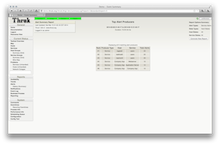</td>
</tr>
</table>
<table border="0">
<tr>
<td>Url:</td>
<td><b>summary.cgi</b></td>
</tr>
</table>
<table border="0" width="100%">
<tr>
<td align="left" valign="top" width="50%">

<b>Description:</b>
This CGI provides some generic reports about host and service alert data, including alert totals, top alert producers, etc.

<b>Authorization Requirements:</b>
<ul>
<li>If you are <a href="configcgi.html#authorized_for_all_hosts"><i>authorized for all hosts</i></a> you can view summary information for all hosts <b>and</b> all services.</li>
<li>If you are <a href="configcgi.html#authorized_for_all_services"><i>authorized for all services</i></a> you can view summary information for all services.</li>
<li>If you are an <i>authenticated contact</i> you can view summary information for all services and hosts for which you are a contact.</li>
</ul>
</td>
</tr>
</table>

### Additional Pages

* <a href="#business_process_cgi">Business Process CGI</a>
* <a href="#config_tool_cgi">Config Tool CGI</a>
* <a href="#reports_cgi">Reports CGI</a>
* <a href="#panorama_view_cgi">Panorama View CGI</a>
* <a href="#minemap_cgi">Minemap CGI</a>
* <a href="#mobile_cgi">Mobile CGI</a>

#### Business Process CGI

<table border="0" class="screenshot_thumbnails">
<tr>
<td align="left">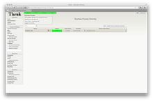</td>
<td align="left">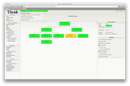</td>
</tr>
</table>

<table border="0">
<tr>
<td>Url:</td>
<td><b>bp.cgi</b></td>
</tr>
</table>

<table border="0" width="100%">
<tr>
<td align="left" valign="top" width="50%">

<b>Description:</b>
The Business Process CGI can manage, create and edit your business processes.
It allows you to combine single host and service states in complex calculations
which represent business logic. These business processes can then be used as
naemon services to accomplish standard tasks like notifications and reporting.

<b>Authorization Requirements:</b>
<ul>
<li>If you are <a href="configcgi.html#authorized_for_configuration_information"><i>authorized for configuration information</i></a> and <a href="configcgi.html#authorized_for_system_commands"><i>authorized for system commands</i></a> you can <b>view and edit</b> all business processes.</li>
<li>If you are an <i>authenticated contact</i> you can view all business processes for which you are a contact.</li>
</ul>
</td>
</tr>
</table>

#### Config Tool CGI

<table border="0" class="screenshot_thumbnails">
<tr>
<td align="left">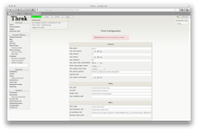</td>
<td align="left">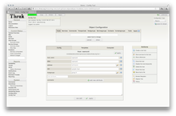</td>
<td align="left">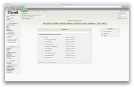</td>
</tr>
</table>

<table border="0">
<tr>
<td>Url:</td>
<td><b>conf.cgi</b></td>
</tr>
</table>

<table border="0" width="100%">
<tr>
<td align="left" valign="top" width="50%">

<b>Description:</b>
The Config Tool CGI can change many settings within Thruk and also can be used to manage
Naemon objects like hosts, services, commands, etc...

<b>Authorization Requirements:</b>
<ul>
<li>If you are <a href="configcgi.html#authorized_for_configuration_information"><i>authorized for configuration information</i></a> and <a href="configcgi.html#authorized_for_system_commands"><i>authorized for system commands</i></a> you can <b>view and edit</b> all settings.</li>
</ul>
</td>
</tr>
</table>

#### Reports CGI

<table border="0" class="screenshot_thumbnails">
<tr>
<td align="left">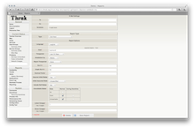</td>
<td align="left">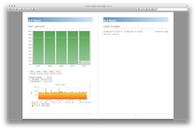</td>
</tr>
</table>

<table border="0">
<tr>
<td>Url:</td>
<td><b>reports2.cgi</b></td>
</tr>
</table>

<table border="0" width="100%">
<tr>
<td align="left" valign="top" width="50%">

<b>Description:</b>
The Reports CGI creates SLA reports and delivers them by mail.

<b>Authorization Requirements:</b>
<ul>
<li>If you are <a href="configcgi.html#authorized_for_configuration_information"><i>authorized for configuration information</i></a> and <a href="configcgi.html#authorized_for_system_commands"><i>authorized for system commands</i></a> you can <b>view and edit</b> all reports.</li>
<li>If you are an <i>authenticated contact</i> you can view and edit all reports for which you are a contact.</li>
</ul>
</td>
</tr>
</table>

#### Panorama View CGI

<table border="0" class="screenshot_thumbnails">
<tr>
<td align="left">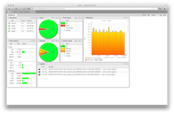</td>
</tr>
</table>

<table border="0">
<tr>
<td>Url:</td>
<td><b>panorama.cgi</b></td>
</tr>
</table>

<table border="0" width="100%">
<tr>
<td align="left" valign="top" width="50%">

<b>Description:</b>
The Panorama CGI lets contacts define individual dashboards on multiple tabs.

<b>Authorization Requirements:</b>
<ul>
<li>If you are an <i>authenticated contact</i> you can view and edit all dashboards for which you are a contact.</li>
</ul>
</td>
</tr>
</table>

#### Minemap CGI

<table border="0" class="screenshot_thumbnails">
<tr>
<td align="left">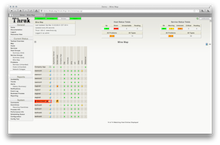</td>
</tr>
</table>

<table border="0">
<tr>
<td>Url:</td>
<td><b>minemap.cgi</b></td>
</tr>
</table>

<table border="0" width="100%">
<tr>
<td align="left" valign="top" width="50%">

<b>Description:</b>
The minemap gives you an brief overview on your hosts and services. It is recommended to
use additional filters. The minemap is especially useful if you have hosts which
share common services names.

<b>Authorization Requirements:</b>
<ul>
<li>If you are <a href="configcgi.html#authorized_for_all_hosts"><i>authorized for all hosts</i></a> you can view minemaps for all hosts <b>and</b> all services.</li>
<li>If you are <a href="configcgi.html#authorized_for_all_services"><i>authorized for all services</i></a> you can view minemaps data for all services.</li>
<li>If you are an <i>authenticated contact</i> you can view all hosts and services for which you are a contact.</li>
</ul>
</td>
</tr>
</table>

#### Mobile CGI

<table border="0" class="screenshot_thumbnails">
<tr>
<td align="left">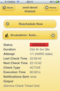</td>
</tr>
</table>

<table border="0">
<tr>
<td>Url:</td>
<td><b>mobile.cgi</b></td>
</tr>
</table>

<table border="0" width="100%">
<tr>
<td align="left" valign="top" width="50%">

<b>Description:</b>
The mobile cgi is designed for mobile devices and should work with all modern mobile
phones like iPhone or Android. It provides an easy way to quickly acknowledge problems
from your mobile.

<b>Authorization Requirements:</b>
<ul>
<li>If you are <a href="configcgi.html#authorized_for_all_hosts"><i>authorized for all hosts</i></a> you can view all hosts <b>and</b> all services.</li>
<li>If you are <a href="configcgi.html#authorized_for_all_services"><i>authorized for all services</i></a> you can view all services.</li>
<li>If you are an <i>authenticated contact</i> you can view all hosts and services for which you are a contact.</li>
</ul>
</td>
</tr>
</table>
