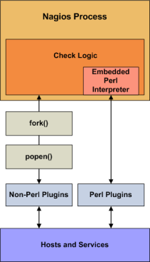

<span class="glyphicon glyphicon-arrow-right"></span> See Also: <a href="epnplugins.html">Developing Plugins For Use With Embedded Perl</a>


{{ site.warn }}
Naemon does not include embedded Perl anymore, however, all ePN related information still applies to <a href="addons.html#mod-gearman">Mod-Gearman</a>.
{{ site.end }}


### Introduction

Mod-Gearman can be compiled with support for an embedded Perl interpreter. This allows Mod-Gearman to execute Perl plugins much
more efficiently that it otherwise would, so it may be of interest to you if you rely heavily on plugins written in Perl.

Without the embedded Perl interpreter, Mod-Gearman executes Perl (and non-Perl) plugins by forking and
executing the plugins as an external command. When the embedded Perl interpreter is used, Mod-Gearman can
execute Perl plugins by simply making a library call.

{{ site.hint }}The embedded Perl interpreter works with all Perl scripts that Mod-Gearman executes - not just plugins.{{ site.end }}

This documentation discusses the embedded Perl interpreter in relation to
plugins used for host and service checks, but it applies just the same to other types of Perl scripts you may be using
for other types of commands (e.g. notification scripts, event handler scripts, etc.).

Stephen Davies contributed the original embedded Perl interpreter code several years back.
Stanley Hopcroft has been the primary person helping to improve the embedded Perl interpreter code
quite a bit and has commented on the advantages/disadvantages of using it.  He has also given several
helpful hints on creating Perl plugins that work properly with the embedded interpreter.

It should be noted that "ePN", as used in this documentation, refers to embedded Perl Mod-Gearman,
or if you prefer, Mod-Gearman compiled with an embedded Perl interpreter.



### Advantages

Some advantages of ePN (embedded Perl in Mod-Gearman) include:

<ul>
<li>Mod-Gearman will spend much less time running your Perl plugins because it no longer forks to
    execute the plugin (each time loading the Perl interpreter). Instead, it executes your
    plugin by making a library call.</li>
<li>It greatly reduces the system impact of Perl plugins and/or allows you to run more checks with
    Perl plugin than you otherwise would be able to.  In other words, you have less incentive to write
    plugins in other languages such as C/C++, or Expect/TCL, that are generally recognized to have
    development times at least an order of magnitude slower than Perl (although they do run about ten
    times faster also - TCL being an exception).</li>
<li>If you are not a C programmer, then you can still get a huge amount of mileage out of Mod-Gearman
    by letting Perl do all the heavy lifting without having Mod-Gearman slow right down.
    Note however, that the ePN will not speed up your plugin (apart from eliminating the interpreter
    load time). If you want fast plugins then consider Perl XSUBs (XS), or C <i>after</i> you are sure that your Perl is tuned and that you have a suitable algorithm (Benchmark.pm is <i>invaluable</i> for comparing the performance of Perl language elements).</li>
<li>Using the ePN is an excellent opportunity to learn more about Perl.</li>
</ul>


### Disadvantages

The disadvantages of ePN (embedded Perl in Mod-Gearman) are much the same as Apache mod_perl
(i.e. Apache with an embedded interpreter) compared to a plain Apache:

<ul>
<li>A Perl program that works <i>fine</i> with plain Naemon may <i>not</i> work with the ePN.
    You may have to modify your plugins to get them to work.</li>
<li>Perl plugins are harder to debug under an ePN than under a plain Naemon.</li>
<li>Your ePN will have a larger SIZE (memory footprint) than a plain Naemon.</li>
<li>Some Perl constructs cannot be used or may behave differently than what you would expect.</li>
<li>You may have to be aware of 'more than one way to do it' and choose a way that seems less attractive or obvious.</li>
<li>You will need greater Perl knowledge (but nothing very esoteric or stuff about Perl internals - unless your plugin uses XSUBS).</li>
</ul>


### Using The Embedded Perl Interpreter

If you want to use the embedded Perl interpreter to run your Perl plugins and scripts, here's what you'll need to do:

<ol>
<li>Compile Mod-Gearman with support for the embedded Perl interpreter (see instructions below).</li>
<li>Enable the `enable_embedded_perl` option in the Mod-Gearman worker configuration file.</li>
<li>Set the `use_embedded_perl_implicitly` option to fit your needs.
    This option determines whether or not the Perl interpreter should be used by default for individual Perl plugins and scripts.</li>
<li>Optionally enable or disable certain Perl plugins and scripts from being run using the embedded Perl interpreter.
    This can be useful if certain Perl scripts have problems being running under the Perl interpreter. See instructions below for more information on doing this.</li>
</ol>


### Compiling Mod-Gearman With Embedded Perl

If you want to use the embedded Perl interpreter, you'll first need to compile Mod-Gearman with support for it.

To do this, simply run the configure script with the addition of the
<font color="red"><i>--enable-embedded-perl</i></font> option.
If you want the embedded interpreter to cache internally compiled scripts, add
the <font color="red"><i>--with-perlcache</i></font> option as well.

Example:

```
    ./configure --enable-embedded-perl --with-perlcache <otheroptions...>
```

Once you've rerun the configure script with the new options, make sure to recompile Mod-Gearman.


### Plugin-Specific Use of the Perl Interpreter

Beginning with Mod-Gearman, you can specify which Perl plugins or scripts should or should not
be run under the embedded Perl interpreter. This is particularly useful if you have troublesome Perl
scripts which do not work well with the Perl interpreter.

To <i>explicitly</i> tell Mod-Gearman whether or not to use the embedded Perl interpreter for a particular
perl script, add one of the following entries to your Perl script/plugin...

To tell Mod-Gearman to use the Perl interpreter for a particular script, add this line to the Perl script:

```
# nagios: +epn
```

To tell Mod-Gearman to NOT use the embedded Perl interpreter for a particular script, add this line to the Perl script:

```
# nagios: -epn
```

Either line must be located within the first 10 lines of a script for Mod-Gearman to detect it.

{{ site.hint }}If you do not <i>explicitly</i> use the method above to tell Mod-Gearman whether an individual plugin can be run under the Perl interpreter, Mod-Gearman will make will a decision for you. This decision process is controlled by the `use_embedded_perl_implicitly` variable.{{ site.end }}

If the value is set to 1, all Perl plugins/scripts (that do not explicitly enable/disable the ePN) will be
run under the Perl interpreter. If the value is 0, they will NOT be run under the Perl interpreter.


### Developing Plugins For Use With Embedded Perl

Information on developing plugins for use with the embedded Perl interpreter can be found <a href="epnplugins.html">here</a>.
