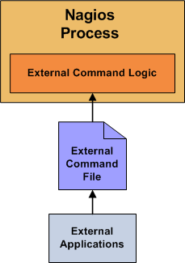



 See Also: <a href="passivechecks.html">Passive Checks</a>, <a href="adaptive.html">Adaptive Monitoring</a>

### Introduction

Naemon can process commands from external applications (including the CGIs) and alter various aspects of its monitoring functions based on the commands it receives.  External applications can submit commands by writing to the <a href="configmain.html#command_file">command file</a>, which is periodically processed by the Naemon daemon.

### Enabling External Commands

In order to have Naemon process external commands, make sure you do the following:

<ul>
<li>Enable external command checking with the <a href="configmain.html#check_external_commands">check_external_commands</a> option.</li>
<li>Specify the location of the command file with the <a href="configmain.html#command_file">command_file</a> option.</li>
<li>Setup proper permissions on the directory containing the external command file, as described in the <a href="quickstart.html">quickstart guide</a>.</li>
</ul>

### When Does Naemon Check For External Commands?

<ul>
<li>Naemon reads and executes external commands immediately when they are submitted.</li>
</ul>

### Using External Commands

External commands can be used to accomplish a variety of things while Naemon is running.  Example of what can be done include temporarily disabling notifications for services and hosts, temporarily disabling service checks, forcing immediate service checks, adding comments to hosts and services, etc.

### Command Format

External commands that are written to the <a href="configmain.html#command_file">command file</a> have the following format...

<pre>
[<i>time</i>] <i>command_id</i>;<i>command_arguments</i>
</pre>

...where <i>time</i> is the time (in <i>time_t</i> format) that the external application submitted the external command to the command file.  The values for the <i>command_id</i> and <i>command_arguments</i> arguments will depend on what command is being submitted to Naemon.

A full listing of external commands that can be used (along with examples of how to use them) can be found in the
<a href="/documentation/developer/externalcommands/">external commands developer guide</a>.
