 See Also: <a href="naemonstats.html">Naemontats Utility</a>, <a href="tuning.html">Performance Tuning</a>

### Introduction

The <a href="naemonstats.html">naemonstats</a> utility allows you to graph various Naemon
performance statistics over time using <a href="http://oss.oetiker.ch/mrtg/">MRTG</a>.
This is important because it can help you:

<ul>
<li>Ensure Naemon is operating efficiently</li>
<li>Locate problem areas in the monitoring process</li>
<li>Observe the performance impacts of changes in your Naemon configuration</li>
</ul>

{{ site.info }}
Since MRTG is not exactly state of the art anymore, you could also use PNP or Graphite.
{{ site.end }}

### Sample MRTG Configuration

Sample MRTG configuration file snippets for graphing various Naemon performance statistics
can be found in the <i>mrtg.cfg</i> file located in the <i>sample-config/</i> subdirectory
of the Naemon distribution. You can create graphs of other performance information if you'd
like - the samples just provide you with a good starting point.

Once you copy these sample entries into your MRTG config file (/etc/mrtg/mrtg.cfg) you
should have some new graphs the next time MRTG runs.

### Example Graphs

I'll describe what a few of the sample MRTG graphs mean and what they can be used for...

<table border="0" cellpadding="10">
<tr>
  <td valign="top">
    

    <b>Active Host Checks</b> - This graph shows how may active host checks (regularly
    scheduled and on-demand) have occurred over time.  Useful for understanding:
    

    <ul>
      <li><a href="hostchecks.html">Host checks</a></li>
      <li><a href="dependencychecks.html">Predictive host dependency checks</a></li>
      <li><a href="cachedchecks.html">Cached checks</a></li>
    </ul>
  </td>
  <td valign="top">
    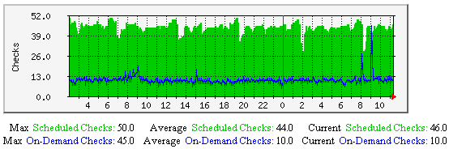
  </td>
</tr>

<tr>
<td valign="top">

<b>Active Service Checks</b> - This graph shows how may active service checks (regularly
scheduled and on-demand) have occurred over time.  Useful for understanding:

<ul>
<li><a href="servicechecks.html">Service checks</a></li>
<li><a href="dependencychecks.html">Predictive service dependency checks</a></li>
<li><a href="cachedchecks.html">Cached checks</a></li>
</ul>
</td>
<td valign="top">
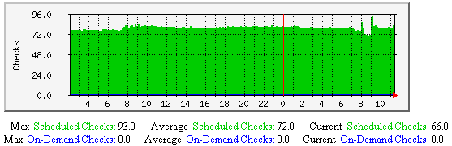
</td>
</tr>

<tr>
<td valign="top">

<b>Cached Host and Service Checks</b> - This graph shows how may cached host and service checks
have occurred over time. Useful for understanding:

<ul>
<li><a href="cachedchecks.html">Cached checks</a></li>
<li><a href="dependencychecks.html">Predictive host and service dependency checks</a></li>
</ul>
</td>
<td valign="top">
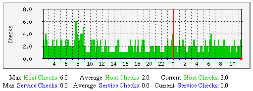
</td>
</tr>

<tr>
<td valign="top">

<b>Passive Host and Service Checks</b> - This graph shows how may passive host and service checks
have occurred over time.  Useful for understanding:

<ul>
<li><a href="passivechecks.html">Passive checks</a></li>
</ul>
</td>
<td valign="top">
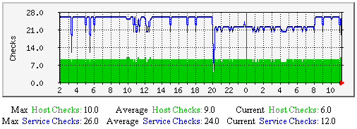
</td>
</tr>

<tr>
<td valign="top">

<b>Hosts/Services Actively Checked</b> - This graph shows how many (of the total number of) hosts
and services were <i>last</i> checked actively over time.  Useful for understanding:

<ul>
<li><a href="activechecks.html">Active checks</a></li>
</ul>
</td>
<td valign="top">
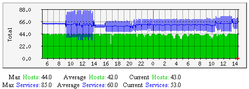
</td>
</tr>

<tr>
<td valign="top">

<b>Hosts/Services Passively Checked</b> - This graph shows how many (of the total number of) hosts
and services were <i>last</i> checked passively over time.  Useful for understanding:

<ul>
<li><a href="passivechecks.html">Passive checks</a></li>
</ul>
</td>
<td valign="top">
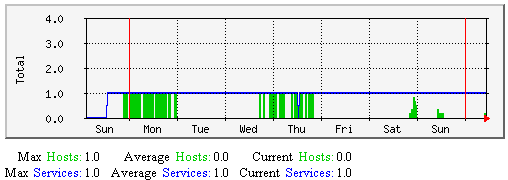
</td>
</tr>

<tr>
<td valign="top">

<b>Average Service Check Latency and Execution Time</b> - This graph shows average service check
latency and execution times over time.  Useful for understanding:

<ul>
<li><a href="servicechecks.html">Service checks</a></li>
<li><a href="tuning.html">Performance tuning</a></li>
</ul>

Consistently high latencies can be an indication that one of more of the following variables need tweaking:

<ul>
<li><a href="configmain.html#max_concurrent_checks">max_concurrent_checks</a></li>
<li><a href="configmain.html#check_result_reaper_frequency">check_result_reaper_frequency</a></li>
<li><a href="configmain.html#max_check_result_reaper_time">max_check_result_reaper_time</a></li>
</ul>
</td>
<td valign="top">
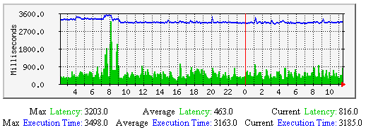
</td>
</tr>

<tr>
<td valign="top">

<b>Average Service State Change</b> - This graph shows the average percent state change (a measure of
volatility) for services over time, broken down by services that were last checked either actively or passively.  Useful for understanding:

<ul>
<li><a href="flapping.html">Flap detection</a></li>
</ul>
</td>
<td valign="top">
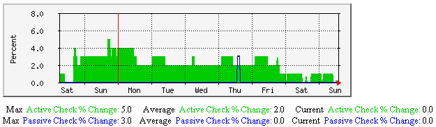
</td>
</tr>

<tr>
<td valign="top">

<b>Average Host Check Latency and Execution Time</b> - This graph shows average host check latency
and execution times over time.  Useful for understanding:

<ul>
<li><a href="hostchecks.html">Host checks</a></li>
<li><a href="tuning.html">Performance tuning</a></li>
</ul>

Consistently high latencies can be an indication that one of more of the following variables need tweaking:

<ul>
<li><a href="configmain.html#max_concurrent_checks">max_concurrent_checks</a></li>
<li><a href="configmain.html#check_result_reaper_frequency">check_result_reaper_frequency</a></li>
<li><a href="configmain.html#max_check_result_reaper_time">max_check_result_reaper_time</a></li>
</ul>
</td>
<td valign="top">
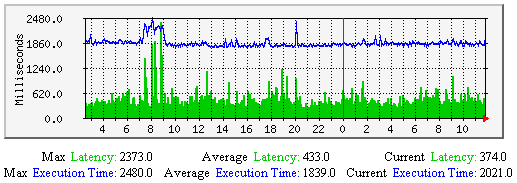
</td>
</tr>

<tr>
<td valign="top">

<b>Average Host State Change</b> - This graph shows the average percent state change (a measure
of volatility) for hosts over time, broken down by hosts that were last checked either actively or passively.  Useful for understanding:

<ul>
<li><a href="flapping.html">Flap detection</a></li>
</ul>
</td>
<td valign="top">
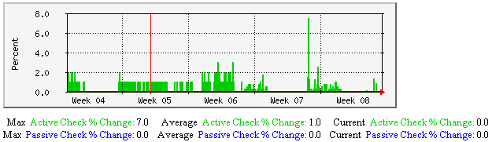
</td>
</tr>

<tr>
<td valign="top">

<b>External Commands</b> - This graph shows how may external commands have been processed
by the Naemon daemon over time. Unless you're processing a large number of external
commands (as in the case with distributed monitoring setups), this graph may appear mostly
empty. Monitoring external commands can be useful for understanding the impacts of:

<ul>
<li><a href="passivechecks.html">Passive checks</a></li>
<li><a href="distributed.html">Distributed monitoring</a></li>
<li><a href="redundancy.html">Redundant/failover monitoring</a></li>
</ul>
</td>
<td valign="top">
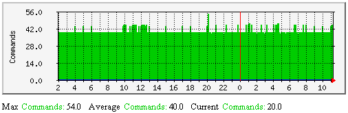
</td>
</tr>
</table>
