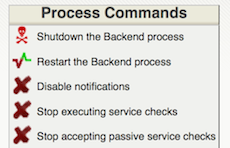

 See Also: <a href="verifyconfig.html">Verifying Your Configuration</a>
  

There's more than one way to start, reload, stop, and restart Naemon.
Here are some of the more common ones.

{{ site.hint }}Always make sure you <a href="verifyconfig.html">verify your configuration</a> before you (re)start Naemon.{{ site.end }}

### Reloading Naemon
The most common scenario will probably be to reload Naemon after changes of Naemon configuration. You don't need to restart Naemon after you added new hosts, commands and services. Simply reload the configuration.

1. <b>Init script</b>: 
   Most distributions supports *service &lt;servicename&gt; reload* command, simply enter
   <pre>service naemon reload</pre>
   or
   <pre>/etc/init.d/naemon reload</pre>
2. <b>Manually:</b>
   You can reload the Naemon process by sending it a SIGHUP signal like so:
   <pre>kill -HUP &lt;naemon_pid&gt;</pre>

### Starting Naemon

1. <b>Init Script:</b>
   The easiest way to start the Naemon daemon is by using the init script like so:
   <pre>service naemon start</pre>
   or
   <pre>/etc/init.d/naemon start</pre>
2. <b>Manually:</b>
   You can start the Naemon daemon manually with the <b>-d</b> command line option like so:
   <pre>/usr/bin/naemon -d /etc/naemon/naemon.cfg</pre>

### Restarting Naemon

Restarting/reloading is necessary when you modify your configuration files and want those changes to take effect.

1. <b>Init Script:</b>
   The easiest way to restart the Naemon daemon is by using the init script like so:
   <pre>service naemon restart</pre>
   or
   <pre>/etc/init.d/naemon restart</pre>
2. <b>Web Interface:</b>
   You can restart the Naemon through the web interface by clicking the
   "Process Info" navigation link and selecting "Restart the Backend process":  
     

### Stopping Naemon

1. <b>Init Script:</b>
   The easiest way to stop the Naemon daemon is by using the init script like so:
   <pre>service naemon stop</pre>
   or
   <pre>/etc/init.d/naemon stop</pre>
2. <b>Web Interface:</b>
   You can stop the Naemon through the web interface by clicking the "Process Info" navigation
   link and selecting "Shutdown the Backend process":  
     
3. <b>Manually:</b>
   You can stop the Naemon process by sending it a SIGTERM signal like so:
   <pre>kill &lt;naemon_pid&gt;</pre>
